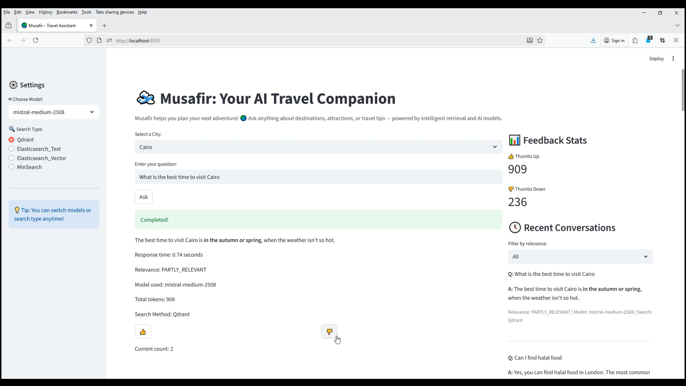
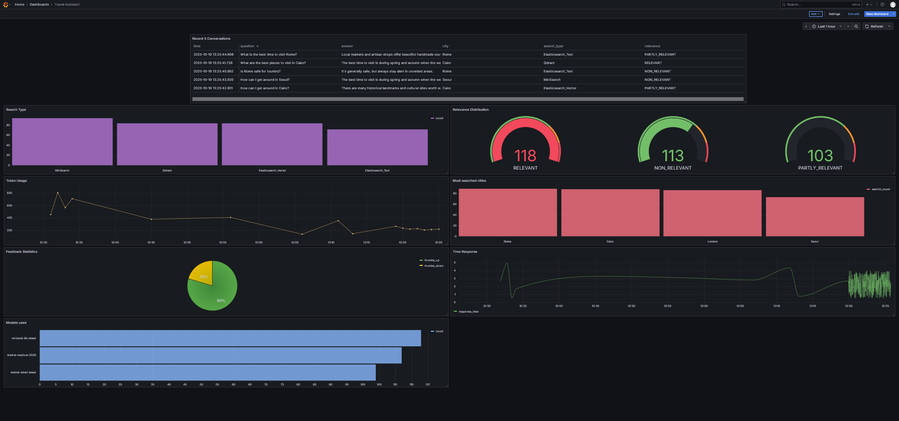
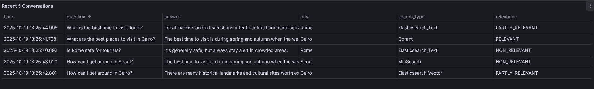
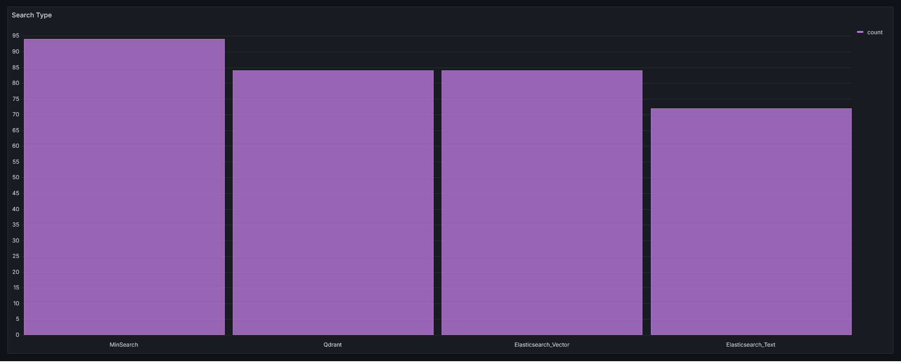
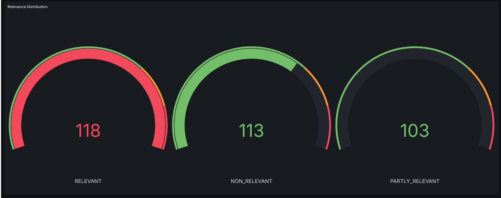
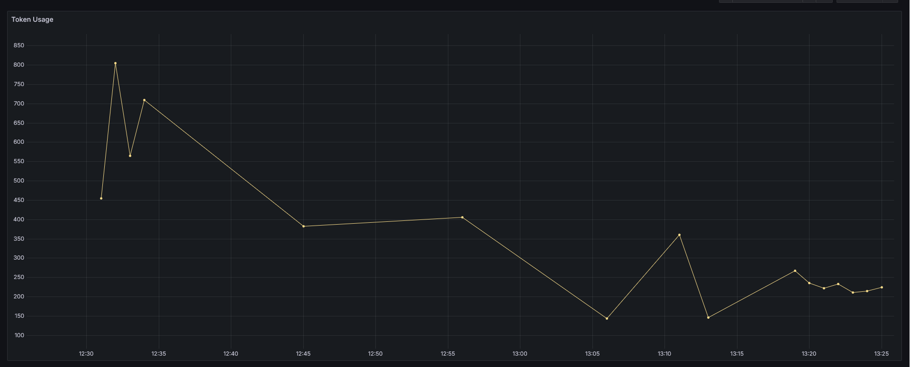
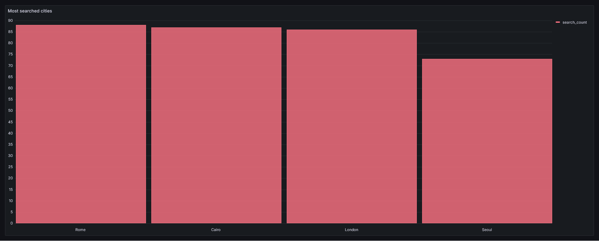
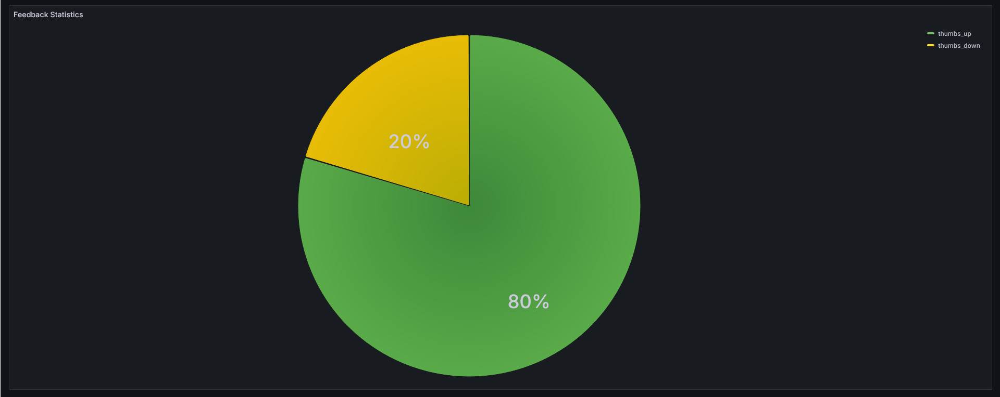
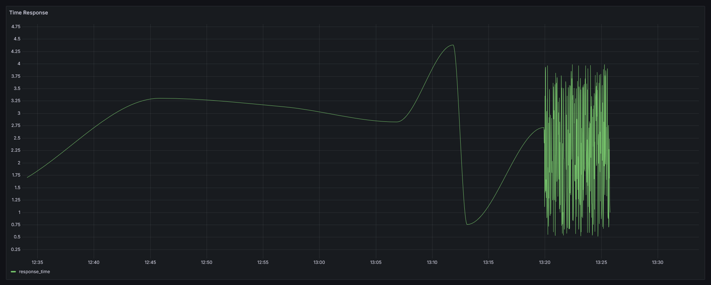
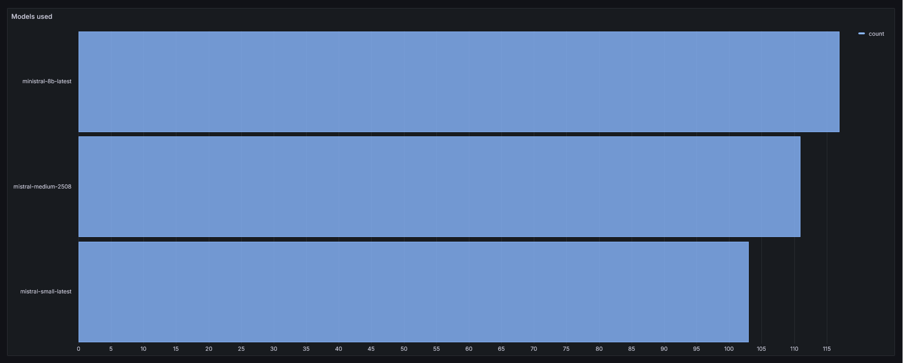

# Musafir


**Musafir**: which means *“traveler”* in Arabic — is an AI-powered travel assistant designed to make exploring the world smarter and easier.  
It helps users discover destinations, plan trips, and get personalized travel insights using intelligent recommendations and real-time information.  

Built with modern AI technologies, **Musafir** combines conversational intelligence, data retrieval, and user feedback to create a seamless travel experience.  
Whether you're planning a weekend getaway or a global adventure, Musafir guides you every step of the way — from inspiration to itinerary.

## Problem Description & Motivation

Planning a trip can be overwhelming, travelers often spend hours searching across multiple platforms for information about destinations, attractions, accommodation, safety tips, and local experiences.  
The challenge is not the lack of data, but rather **information overload** and **fragmentation** across countless sources.

Traditional travel guides and search engines provide static results, while AI chatbots often generate generic answers without reliable or contextually relevant data.  
This creates a gap between **information availability** and **personalized, trustworthy recommendations**.

### Why Musafir?

**Musafir** was built to address these challenges by combining **retrieval-based search** and **AI-driven reasoning**.  
It delivers accurate, context-aware, and dynamic travel insights powered by real data.

Key goals include:
- 🧭 Centralizing travel knowledge from reliable sources like **Wikivoyage**.  
- 💬 Enabling **interactive conversations** with an AI assistant that understands context and preferences.  
- ⚙️ Providing **real-time retrieval** from structured data to generate personalized travel recommendations.  
- 📊 Allowing continuous improvement through a **feedback loop** that learns from user interactions.  
- 🧠 Bridging the gap between **AI creativity** and **authentic travel data** through a RAG architecture.

In short, **Musafir** transforms the way people plan their journeys — turning scattered travel data into meaningful, personalized experiences.


## Project Overview

**Musafir** is a Retrieval-Augmented Generation (RAG) application designed to assist users with their travel plans through intelligent, data-driven insights.

The main use cases include:
- 🗺️ **Destination Discovery:** Get personalized suggestions for destinations based on preferences, budget, and travel goals.  
- ✈️ **Trip Planning Assistance:** Generate step-by-step itineraries, including attractions, activities, and local recommendations.  
- 🏨 **Accommodation & Food Insights:** Retrieve useful information about hotels, restaurants, and hidden gems at your chosen location.  
- 💬 **Conversational Travel Assistant:** Interact naturally with an AI assistant to ask travel-related questions and receive context-aware answers.  

## Dataset

The dataset used in **Musafir** is retrieved from **Wikivoyage**, an open travel guide built and maintained by volunteers.  
For the current version, the application focuses on four major cities:

- 🏙️ **Cairo**  
- 🌆 **London**  
- 🏛️ **Rome**  
- 🌉 **Seoul**

Only selected sections from each city page have been ingested to ensure concise and relevant travel information.  
The extracted sections include:

`"districts"`, `"see"`, `"buy"`, `"eat"`, `"drink"`, `"sleep"`, and `"stay safe"`

If you wish to extend the dataset by adding more sections or cities, you can easily customize the ingestion process in: [notebooks/1. Ingest data.ipynb](notebooks/1.%20Ingest%20data.ipynb)
 
This notebook is a Python script customized to extract relevant data from Wikivoyage. It can be easily modified to specify which cities and sections to scrape, preparing the content for indexing in the retrieval pipeline.

The collected data is organized into two stages:
- **Raw data:** stored in [data/raw_data](data/raw_data)  
- **Processed and combined data:** stored in [data/processed_data/all_cities_combined_clean.csv](data/processed_data/all_cities_combined_clean.csv)

## Tech Stack


### Core Components

- **Programming Language:** Python  
- **Application Framework:** Streamlit — for building an interactive and user-friendly interface  
- **Containerization:** Docker & Docker Compose — for seamless deployment and environment management  

### Search & Retrieval

Musafir supports multiple retrieval backends for flexibility and experimentation:

1. **MinSearch** — A lightweight text search index using **TF-IDF** and **cosine similarity** for text fields, plus exact matching for keyword fields.  
2. **Elasticsearch** — Combines **text-based search** with **vector similarity search** for hybrid retrieval.  
3. **Qdrant** — A high-performance **vector database** for semantic retrieval and scalable RAG systems.

### AI & Language Model

- **LLM Models:** Supports free Mistralai models such as `mistralai/Mistral-7B-Instruct` and `mistralai/mistral-medium`.  
- **RAG Pipeline:** Integrates document retrieval with context-aware text generation.

### Data & Storage

- **Data Source:** A python script has been written to extract data from Wikivoyage website (specific sections for selected cities).  
- **Database:** PostgreSQL — used to store user conversations, RAG responses, and feedback.  

### Monitoring & Analytics

- **Grafana:** Used for real-time monitoring and visualization of application performance, conversation logs, and feedback metrics.
---

## Installation & Setup

Follow the steps below to set up and run **Musafir** on your local machine.

### 1. Clone the Repository

```bash
git clone https://github.com/HagerAhmed/Musafir.git
cd Musafir
```
### 2. Create and Activate a Virtual Environment
#### For Linux / macOS:
```bash
python -m venv venv
source venv/bin/activate
```
#### For Windows (PowerShell):
```bash
python -m venv venv
venv\Scripts\Activate.ps1
```
### 3. Install Dependencies
```bash
pip install -r requirements.txt
```
### 4. Run with Docker
```bash
docker-compose up --build
```

### 5. Environment Variables
Create a .env file in the project root directory and add the following keys:

#### Mistral API Key (get yours here: https://admin.mistral.ai/organization/api-keys)
MISTRAL_API_KEY=your_mistral_api_key_here

#### PostgreSQL Configuration
- POSTGRES_USER=your_username

- POSTGRES_PASSWORD=your_password

### 6. Using OpenAI Instead of Mistral (Optional)
If you want to switch from Mistral to OpenAI, modify your LLM function as follows:
```bash
def llm(prompt):
    response = llm_client.chat.completions.create(
        model="gpt-4o-mini",
        messages=[{"role": "user", "content": prompt}],
    )
    return response.choices[0].message.content
```
Add your OpenAI key to the .env file:
```bash
OPENAI_API_KEY=your_openai_api_key_here
```

### 7. Run the Application
```bash
streamlit run app.py
```

## System Workflow

1. **User Query (Streamlit):** The user enters a travel-related question or request.

2. **Search Engine:** The query is processed through one of the retrieval backends:
    - MinSearch (TF-IDF + Cosine Similarity)
    - Elasticsearch (Keyword + Vector Hybrid Search)
    - Qdrant (Hybrid Dense + Sparse Fusion)

3- **RAG Pipeline:** Retrieved context is passed to the language model (LLM) for response generation.

4- **LLM (Mistral):** Generates contextual and informative travel recommendations.

5- **PostgreSQL:** Stores conversations, retrieved contexts, and user feedback.

6- **Grafana:** Monitors system performance, user interactions, and feedback trends.


## Search Evaluation & Selected Methods

Musafir integrates multiple retrieval engines to ensure robust and flexible information access.  
Each engine was evaluated using **Hit Rate** and **Mean Reciprocal Rank (MRR)** metrics to assess accuracy and ranking quality.

- **Hit Rate** – Measures how often the correct answer appears in the top retrieved results.  
- **Mean Reciprocal Rank (MRR)** – Evaluates how highly the correct answer is ranked within the result list.

###  Summary of Evaluation Results

 1. **MinSearch**

| Engine | Method | Hit Rate | MRR |
|--------|---------|-----------|------|
| **MinSearch** | Baseline | 0.8552 | 0.7136 |
| **MinSearch** | City Filter | 0.8589 | **0.7565** |
| **MinSearch** | Boosted | **0.8718** | 0.7259 |


2. **Elasticsearch**

| Engine | Method | Hit Rate | MRR |
|--------|---------|-----------|------|
| **Elasticsearch** | Baseline | 0.8630 | 0.7414 |
| **Elasticsearch** | Filtered | 0.8538 | 0.7652 |
| **Elasticsearch** | Text Hybrid | 0.8715 | 0.7861 |
| **Elasticsearch** | All Data (Hybrid Vector) | **0.8751** | **0.7886** |

3. **Qdrant**

| Engine | Method | Hit Rate | MRR |
|--------|---------|-----------|------|
| **Qdrant** | Semantic (Baseline) | 0.8593 | 0.7513 |
| **Qdrant** | Semantic (Filtered) | 0.8674 | 0.7655 |
| **Qdrant** | Sparse BM25 | 0.8471 | 0.7387 |
| **Qdrant** | Multi-step (Dense + Sparse) | 0.8667 | 0.7567 |
| **Qdrant** | **Hybrid Dense + Sparse (RRF)** | **0.9153** | **0.8051** |

---

### Implementation Overview

#### MinSearch
A simple search index built using **TF-IDF** and **cosine similarity** for text fields, combined with exact matching for keyword fields.  
Several configurations were tested, and the **City Filtered Search** setup was selected due to its better ranking quality (**MRR = 0.7565**) even though the boosted variant had a slightly higher Hit Rate.

#### Elasticsearch
Two main search strategies were implemented:

- **`elastic_search_filter()`**  
  Performs a multi-field keyword search (`city`, `section`, `subsection`, `text`) with a **city-based filter**.
  
- **`elastic_search_hybrid()`**  
  Combines **keyword-based** and **vector-based retrieval**, both weighted and filtered by city relevance for improved contextual accuracy.

The **hybrid vector search** variant (`all_data_es`) achieved the best overall Elasticsearch results with a **Hit Rate of 0.8751** and **MRR of 0.7886**.

#### Qdrant
Multiple configurations were tested, including **semantic**, **sparse (BM25)**, and **multi-step** searches.  
The **Hybrid Dense + Sparse** approach achieved the **highest performance overall**, with **Hit Rate = 0.9153** and **MRR = 0.8051**.

It uses **Reciprocal Rank Fusion (RRF)** to combine dense and sparse embeddings effectively:
```python
query=models.FusionQuery(fusion=models.Fusion.RRF)
```

## 💻 Streamlit Interface & Application Workflow

[](https://youtu.be/yxUEsKmmDQk)

Musafir provides an **interactive Streamlit interface** that allows users to explore destinations, ask travel-related questions, and receive AI-generated recommendations in real time.

---

### Application Flow

1. **Data Preparation & Indexing**

   Before running the app, make sure the dataset and retrievers are properly set up.

   - **Fetch and preprocess dataset:**  
     ```bash
     python prep.py
     ```
     This script retrieves and cleans travel data from Wikivoyage, then indexes it in **Elasticsearch**.

   - **Index with MinSearch:**  
     ```bash
     python minsearch_client.py
     ```
     Builds a lightweight **TF-IDF**-based index for local text search.

   - **Index with Qdrant:**  
     ```bash
     python qdrant.py
     ```
     Uploads embeddings and metadata to **Qdrant** for hybrid (dense + sparse) search.

---

2. **RAG Pipeline (Retrieval-Augmented Generation)**

   - **Run the RAG Assistant:**
     ```bash
     python assistant.py
     ```
     This script defines the complete **RAG flow**, including:
     - LLM selection and setup (Mistral)
     - Integration with chosen retriever (MinSearch, Elasticsearch, or Qdrant)
     - Prompt structure and response handling
     - Mapping of LLM output relevance to user queries

---

3. **Database Initialization**

   - **Initialize PostgreSQL Tables:**
     ```bash
     python db.py
     ```
     Creates two key tables:
     - **conversation** → stores user questions, model answers, search method, model name, selected city, response time, and relevance, etc.  
     - **feedback** → stores user feedback about the generated answers  

---

4. **Launch the Streamlit App**

   Once everything is configured, start the interactive application with:
   ```bash
   streamlit run app.py
    ```
The application is available and running at:
 **http://localhost:8501/**


 ## Monitoring Dashboard (Grafana)

Musafir integrates **Grafana** for real-time monitoring of user interactions, model performance, and database activity.

The Grafana dashboard provides valuable insights into:
- Query trends  
- Model usage  
- Response times  
- Feedback statistics  
- City and search type analytics  

---

### Accessing Grafana



Once the Docker container or local server is running, Grafana can be accessed at:

👉 **[http://localhost:3000](http://localhost:3000)**

Login with your Grafana credentials (default: `admin / admin`) and select the **Travel Assistant  Dashboard**.

---

### Charts Explained

#### **1️⃣ Recent Conversations Table**


Displays the five most recent conversations between the user and the assistant, including:

- question → user query

- answer → model response

- city → selected travel city

- search_type → retriever used (Elasticsearch, MinSearch, or Qdrant)

- relevance → how relevant the answer was

Useful for monitoring recent user activity and ensuring correct retrieval behavior.

### 2️⃣ Search Type Distribution


Shows which retrieval method (e.g., Elasticsearch, Qdrant, or MinSearch) is used most frequently.
Helps compare the popularity and performance of each retriever type.

### 3️⃣ Relevance Distribution


Displays how many responses fall into each relevance category (e.g., RELEVANT, PARTLY_RELEVANT, NON_RELEVANT).
Useful for tracking model accuracy and response quality over time.

### 4️⃣ Average Tokens Over Time


Tracks the average number of tokens (input + output) used per query over time.
This helps assess LLM cost efficiency and prompt optimization performance.

### 5️⃣ Most searched Cities


Shows the most popular travel destinations users are exploring.
Helps identify top-interest cities for users of Musafir.

### 6️⃣ User Feedback Summary


Displays the total count of positive (👍) and negative (👎) feedback submitted by users.
Provides a quick health check of user satisfaction with generated answers.

### 7️⃣ Model Response Time Over Time


Plots response time trends to identify latency issues or performance degradation in model inference or retrieval speed.

### 8️⃣ Model Usage Statistics


Shows which models are used most often.
Helps evaluate user preference and model performance trends.


## Future Improvements & Next Steps

---

### Data Expansion & Customization

* **Enhance the ingestion pipeline** to allow users to add their own cities dynamically.
* **Incorporate user preferences** (budget, travel style, or interests) to generate more tailored travel recommendations.

### LLM Evaluation & Monitoring

* **Integrate Phoenix** for real-time LLM evaluation, tracing, and monitoring, helping to assess model performance and identify areas for improvement.

### Model Flexibility

* **Extend support for different LLMs** such as Groq, OpenAI models, and future open-weight models for better adaptability and cost-efficiency.

### Scalability & Optimization

* **Optimize retrieval and embedding pipelines** for larger datasets and multilingual support.
* **Continue improving system monitoring and model feedback loops** for continuous learning.

## Acknowledgements
Special thanks to Alexey Grigorev and his team for the LLM Zoomcamp Project, which inspired the architecture and implementation of this application.
